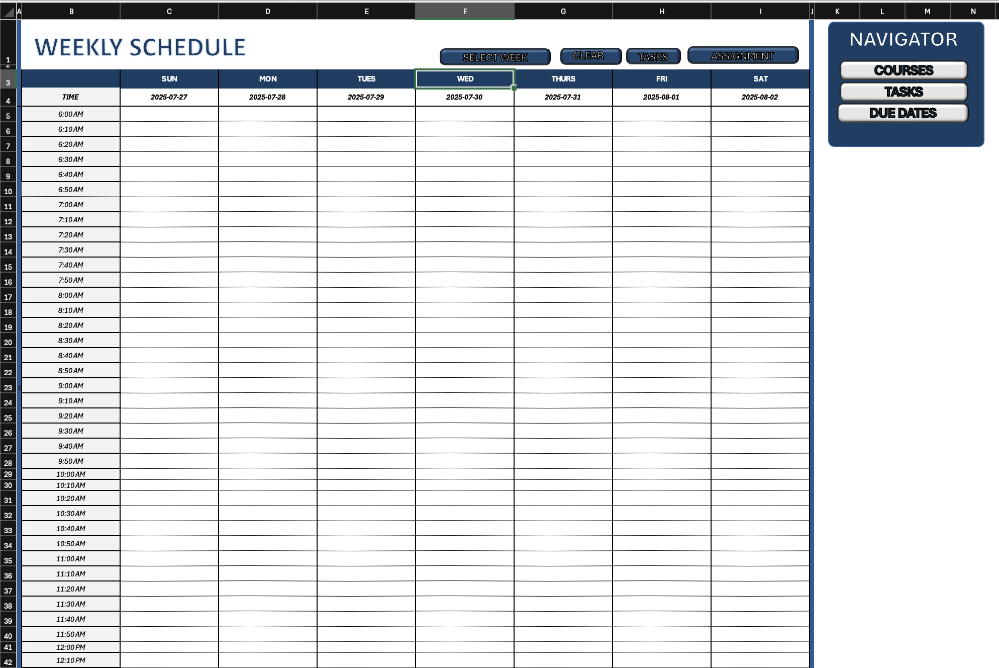
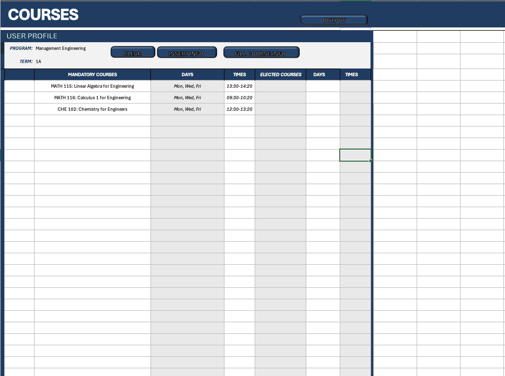
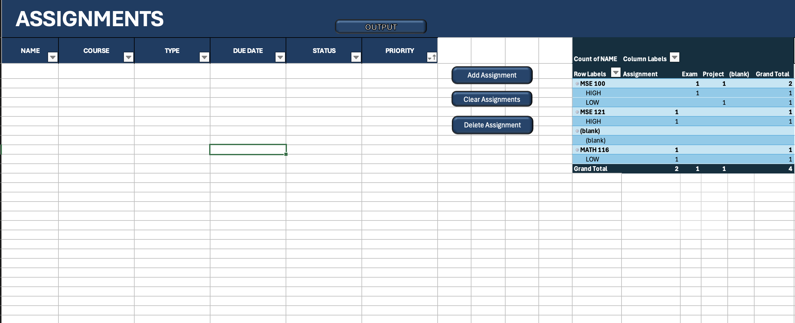
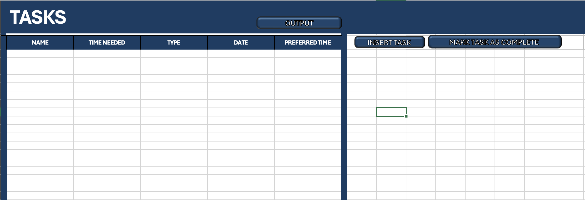

# 🕒 Time Management Tool 📅  
_A smart time management tool for staying organized and productive!_

## ✨ Features  
1. **📆 Weekly Schedule Display**  
   - Get a clear and organized view of your weekly schedule, broken down into manageable 10-minute time slots.  
2. **⏰ Reminder System**  
   - Never miss an important task or deadline with colorful reminders.
3. **🤖 Automated Task Scheduling**  
   - Input your tasks, and the tool will automatically schedule them based on preferred times.

---

## 🛠️ How It Works  
### 1. **Input Your Schedule and Tasks**  
   - Add your weekly classes, work hours, or personal commitments.  
   - Input deadlines and task durations.  

### 2. **Let the Tool Do the Work**  
   - The tool dynamically adjusts your schedule to fit tasks where they best belong.  
   - Overlapping commitments? No problem! The system suggests alternatives.  

### 3. **Stay Notified and On Track**  
   - Get indicators on important due dates
   - Visual highlights on overdue or high-priority tasks.  

---

## 🚀 Getting Started  

### **Prerequisites**  
- 💻 Microsoft Excel (version 2016 or later recommended).  
- 📁 Enable Macros in Excel for full functionality.  

### **Installation**   
1. Open `TimeManagementTool.xlsm` in Excel.  
2. Allow macro-enabled content when prompted.  

---

## 📊 User Interface  

### Dashboard  
View an overview of your weekly schedule and key tasks.  
  

### Courses  
Manage and view your course schedules in one place.  
  

### Assignments  
Track assignment deadlines and priorities with ease.  
  

### Tasks  
Add and monitor daily tasks to ensure nothing gets missed.  
  

---

## 🛠️ Built With  
- **Excel VBA (Macros)**  
- **Conditional Formatting** for a color-coded calendar display.  
- **Pivot Tables** for flexible data filtering and insights.  

---

**Happy scheduling! 🎉**
